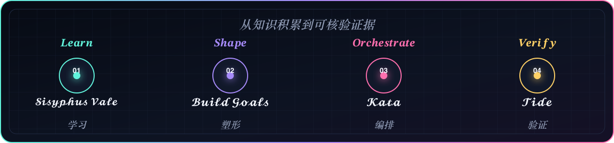
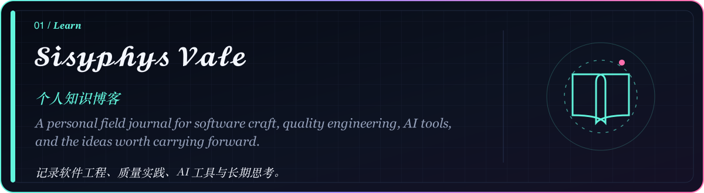
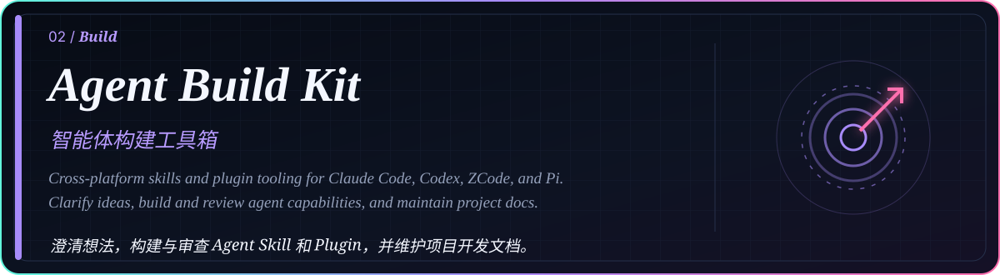
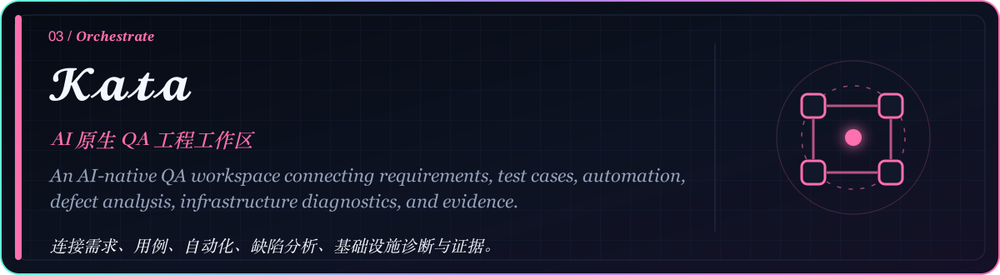
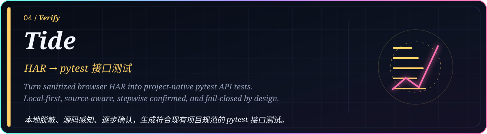
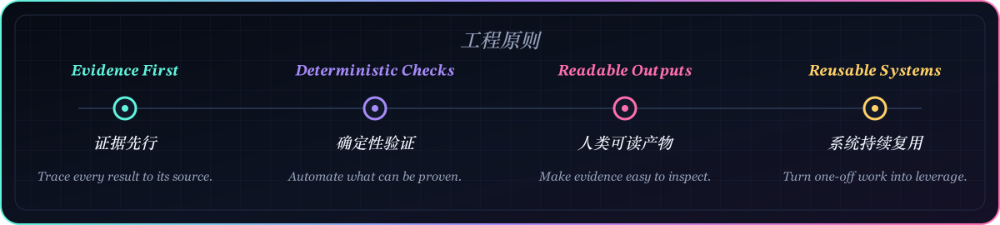

# 𝓚𝓸𝓬𝓸

<picture>
  <source media="(max-width: 600px)" srcset="./assets/profile-hero-mobile.svg">
  
</picture>

 

  

<h2 align="center">𝑨𝒈𝒆𝒏𝒕 𝑶𝒑𝒆𝒓𝒂𝒕𝒊𝒏𝒈 𝑳𝒐𝒐𝒑</h2>

<picture>
  <source media="(max-width: 600px)" srcset="./assets/agent-loop-mobile.svg">
  
</picture>

<h2 align="center">𝑺𝒆𝒍𝒆𝒄𝒕𝒆𝒅 𝑺𝒚𝒔𝒕𝒆𝒎𝒔</h2>

<picture>
  <source media="(max-width: 600px)" srcset="./assets/project-sisyphus-vale-mobile.svg">
  
</picture>

  
  
  
  
  

 

<picture>
  <source media="(max-width: 600px)" srcset="./assets/project-agent-build-kit-mobile.svg">
  
</picture>

  
  
  
  
  

 

<picture>
  <source media="(max-width: 600px)" srcset="./assets/project-kata-mobile.svg">
  
</picture>

  
  
  
  
  

 

<picture>
  <source media="(max-width: 600px)" srcset="./assets/project-tide-mobile.svg">
  
</picture>

  
  
  
  
  

<h2 align="center">𝑬𝒏𝒈𝒊𝒏𝒆𝒆𝒓𝒊𝒏𝒈 𝑷𝒓𝒊𝒏𝒄𝒊𝒑𝒍𝒆𝒔</h2>

<picture>
  <source media="(max-width: 600px)" srcset="./assets/engineering-principles-mobile.svg">
  
</picture>

<h2 align="center">𝑻𝒐𝒐𝒍𝒄𝒉𝒂𝒊𝒏</h2>

  

𝑩𝒖𝒊𝒍𝒅 𝒖𝒔𝒆𝒇𝒖𝒍 𝒔𝒚𝒔𝒕𝒆𝒎𝒔. 𝑳𝒆𝒂𝒗𝒆 𝒂𝒖𝒅𝒊𝒕𝒂𝒃𝒍𝒆 𝒆𝒗𝒊𝒅𝒆𝒏𝒄𝒆. 𝑲𝒆𝒆𝒑 𝒍𝒆𝒂𝒓𝒏𝒊𝒏𝒈 𝒊𝒏 𝒑𝒖𝒃𝒍𝒊𝒄.

  

  

